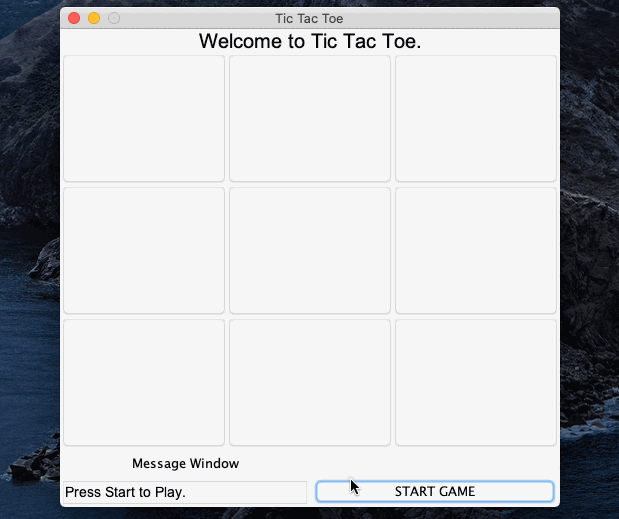
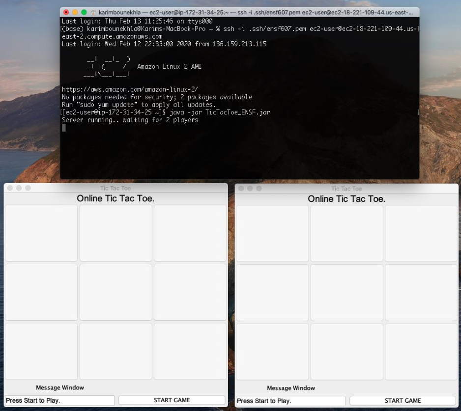
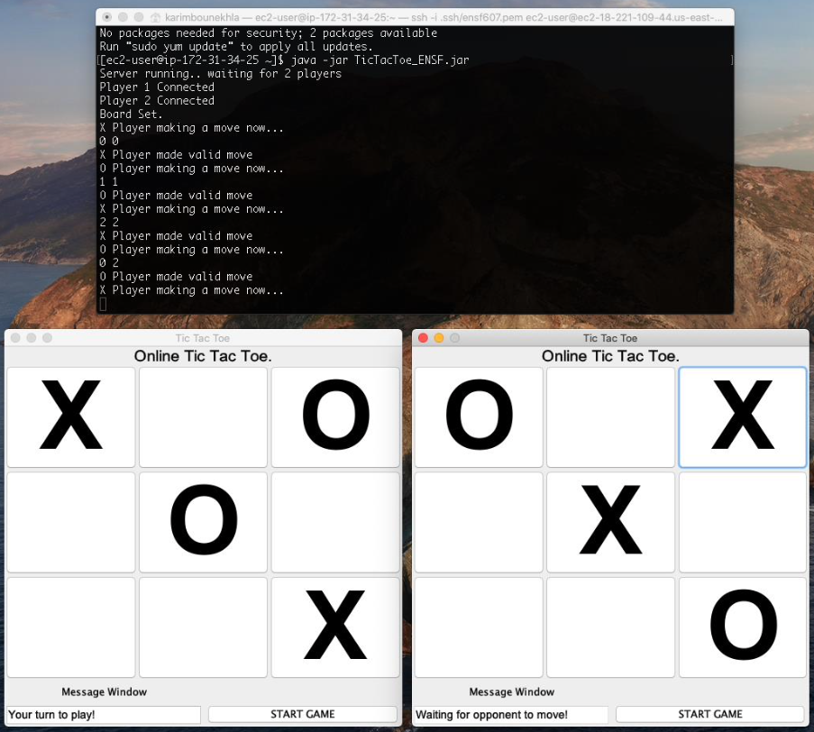
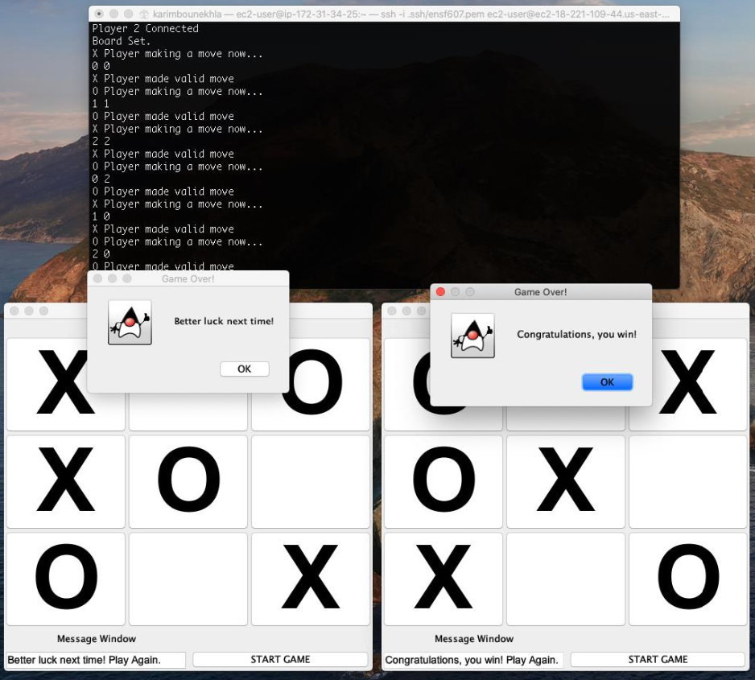

# Tic Tac Toe
Tic Tac Toe game built using Java and the Swing Library (GUI) - following the MVC design pattern.

Features Human vs Human or Human vs AI (3 levels of AI difficulty)

**Updated**: Now features online multiplayer (head to head), using a server hosted on Amazon EC2

## Tools 

* Java / Swing Library

## Gameplay (Local)



## Gameplay (Online)








## Getting Started

These instructions will get you a copy of the project up and running on your local machine for development and testing purposes. 

### Prerequisites

You will need Java 8.x SDK or more recent

### Installing

A step by step series of examples that tell you how to get a development env running

#### Option 1 (Local play only)
A `.jar` file is available to run the game directly. 

`https://github.com/karimbounekhla/tictactoe-java/blob/master/out/artifacts/tictactoe_java_jar/tictactoe-java.jar`

#### Option 2
Download all src (`.java`) files into a folder.

Open a shell on the machine you wish to compile on.
Change directory (cd) to the directory that contains the source file(s) (`.java`) that you want to compile.
Enter the following command:

```
javac *.java
```

Ensure that `.class` files have been created for all files, then enter the following to run.

```
java TicTacToeApp
```

### Online Play

Generate a `.jar` file of `TicTacToeServerV2.java`

Deploy it an Amazon EC2 instance, then run it.

Instructions: https://tecadmin.net/install-java-on-amazon-linux/

In `TictacToeApp.java`, assign the `ip` and `port` of your EC2 instance (or any other server of your choice). This can be fully done on the EC2 free-tier however.

Run `TicTacToeApp.jar` on your clients, the game will start once two clients have connected.

## License / Copyright

* This project is licensed under the MIT License.
